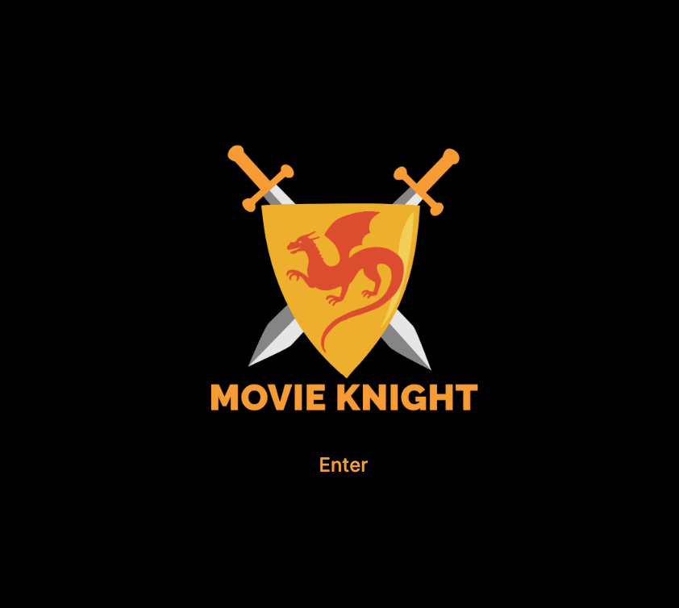
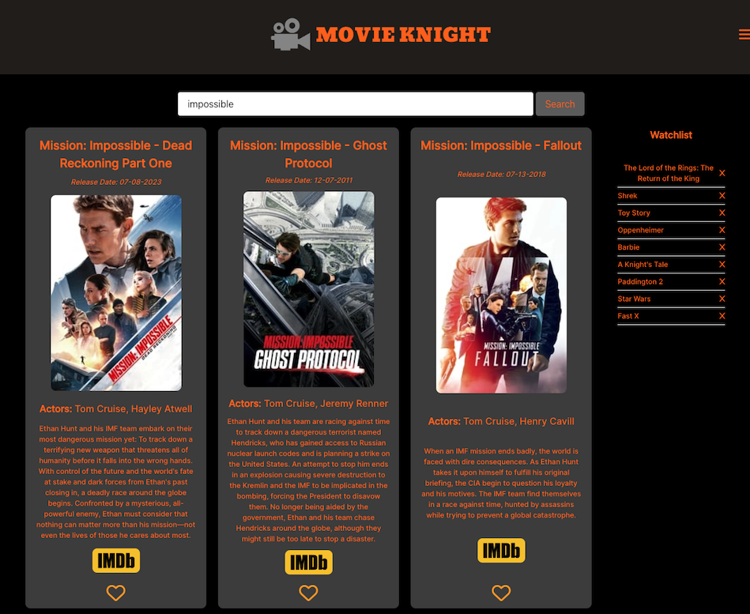

# UC Berkeley Coding Bootcamp - Group Project 1
## Movie Knight - Movie Title Search Engine
The Movie Knight project is an innovative web application that allows users to search for and explore detailed information about movies effortlessly. Leveraging the power of The Movie Database (TMDB) and IMDb APIs, users can enter the movie's title and access relevant details, including release date, movie poster, actors, and plot description. The application showcases movie data elegantly through visually appealing movie cards, and with help of the CSS framework Bulma, provides an interactive user experience. Moreover, Movie Knight enables users to create and manage their personalized watchlist, with seamless integration of local storage for persistent data retention. The project exemplifies a professional and polished implementation, utilizing HTML, CSS, JavaScript, and various libraries, ensuring responsiveness and a captivating UI design.

## Table of Contents 
- [User Story](#user-story)
- [Acceptance Criteria](#acceptance-criteria)
- [Installation](#installation)
- [Usage](#usage)
- [Features](#features)
- [Contributing](#contributing)
- [Support](#support)
- [Acknowledgements](#acknowledgements)
- [Authors](#authors)
- [Deployed Application](#link-to-deployed-application)
- [Webpage Screenshots](#webpage-screenshots)

## User Story
AS a user
I WANT I want to be able to search for movies by title and add them to my watchlist
SO THAT  I can keep track of all of my favorite movies.

## Acceptance Criteria
GIVEN that I am a user on Movie Knight,
WHEN I enter the website,
THEN I should be brought to a landing page.
WHEN I navigate to the search page,
THEN I see a header containing our logo and hamburger-style menu, as well as an input field and search button.
WHEN I enter the name of a movie and click search,
THEN I should see movie cards displayed matching that title, in addition to their release date, movie poster, actors, and description. 
WHEN I click the heart icon inside a movie card,
THEN I can save a movie to my watchlist.
WHEN movies are saved to my watchlist,
THEN the heart icon should turn pink, and the title should populate in the watchlist, located in the sidebar of the webpage.

## Installation
No special installation is necessary to view this project.

## Usage 
This project is intended for education purposes only.

## Features
- HTML / CSS / JavaScript / Bulma
- JavaScript Libraries: jQuery / Day.js / Sweet Alert2
- Local Storage / Fetch API
- Font Awesome / Google Fonts
Server-Side APIs:
- The Movie Database: https://developer.themoviedb.org/reference/intro/getting-started
- IMDb API: https://rapidapi.com/apidojo/api/imdb8 (via RapidApi)

## Authors
Bonne Bautista / Patrick McClelland / Walter Craigie / Will Grey

## Contributing
No other contributors have added to this project.

## Support
N/A

## Acknowledgements
N/A

## Link to Deployed Application
To access the deployed application, please click the link below:
https://btbautista31.github.io/movie_knight/

## Webpage Screenshots

